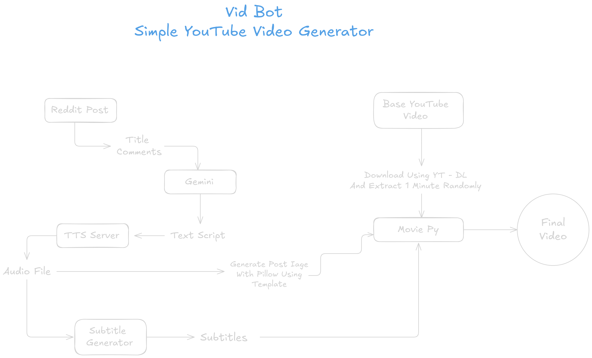

# VidBot

Simple YouTube Shorts Creator Using Gemini!

## Development ~

This Project Uses UV As The Dependency Manager, If UV Is Not Installed ~ 
Install It Using 
```
pip install uv
```

1. Clone The Repository ~
   ```
   https://github.com/SpreadSheets600/VidBot.git
   ```
3. Get Into The Directory ~
   ```
   cd VidBot
   ```
5. Use UV To Initialize The Repository ~
   ```
   uv sync
   ``` 
7. Start The Project ~
   ```
   uv run main.py
   ```

## Under Development ~


